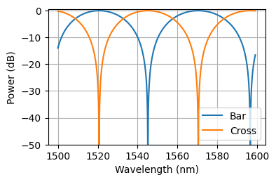
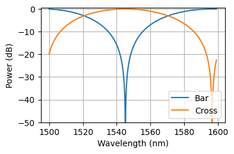

# Topic-6-WDM-Cascaded-MZIs

Repositorio de trabajo para el diseno, simulacion y generacion de layout de un demultiplexor WDM de 8 canales basado en interferometros Mach-Zehnder (MZI) en cascada.

El primer MZI define las ventanas espectrales principales de los 8 canales. Los MZI posteriores actuan como filtros en cascada para separar progresivamente los canales hasta obtener las salidas individuales.

## Objetivo

El proyecto implementa un WDM para la banda de 1500 nm a 1600 nm. La arquitectura separa primero los canales pares e impares y despues divide cada rama mediante MZI adicionales:

- Etapa 1: un MZI de entrada separa la respuesta espectral en dos ramas principales.
- Etapa 2: dos MZI dividen las ramas superior e inferior.
- Etapa 3: cuatro MZI completan la separacion de los 8 canales de salida.

La diferencia de longitud base usada para el primer MZI es `L_FSR = 23 um`, asociada a un FSR aproximado de 25 nm. En las etapas siguientes se usan diferencias de longitud reducidas para ampliar las ventanas de filtrado:

- `MZI_IN`: `L_FSR`
- `MZI_TP` y `MZI_BM`: `L_FSR / 2`
- `MZI_1_5`, `MZI_2_6`, `MZI_3_7` y `MZI_4_8`: `L_FSR / 4`

## Estructura del repositorio

```text
.
├── P01_WDM_Simulation.ipynb    # Simulacion espectral del WDM
├── P02_WDM_Layout.ipynb        # Construccion del layout en gdsfactory
├── WaveguideINFO.ipynb         # Calculo de propiedades opticas de guias SOI y SiN
├── Playground.ipynb            # Pruebas y generacion de figuras para informe
├── SOI_Waveguide.npy           # Datos de indice efectivo para guia SOI
├── SIN_Waveguide.npy           # Datos de indice efectivo para guia SiN
├── LayoutWDM.gds               # Layout GDS generado
├── IMG/                        # Figuras de simulacion y resultados
├── src/upvfab/                 # PDK/celdas auxiliares para gdsfactory
├── pyproject.toml              # Dependencias del proyecto
└── uv.lock                     # Versiones bloqueadas de dependencias
```

## Requisitos

El proyecto usa Python 3.12 o superior. Las dependencias principales son:

- `gdsfactory==9.34.0`
- `gplugins[sax,femwell,tidy3d]==2.0.1`
- `cspdk>=1.4.2`
- `numpy`, `matplotlib` y utilidades cientificas usadas desde los notebooks

La forma recomendada de instalar el entorno es con `uv`, ya que el repositorio incluye `uv.lock`.

```bash
uv sync
```

Para abrir los notebooks:

```bash
uv run jupyter lab
```

Si se usa otro gestor de entornos, instalar el paquete local y sus dependencias desde `pyproject.toml`.

## Flujo de trabajo recomendado

1. Ejecutar `WaveguideINFO.ipynb` si se necesitan regenerar los archivos `SOI_Waveguide.npy` y `SIN_Waveguide.npy`.
2. Ejecutar `P01_WDM_Simulation.ipynb` para calcular la respuesta espectral del WDM y verificar la separacion de canales.
3. Ejecutar `P02_WDM_Layout.ipynb` para construir los MZI termicamente sintonizables, conectarlos en cascada y visualizar el layout.
4. Exportar o revisar `LayoutWDM.gds` con KLayout u otra herramienta compatible con GDS.

## Simulacion

El notebook `P01_WDM_Simulation.ipynb` contiene:

- matriz de transferencia del acoplador 50/50;
- funcion de transferencia de un MZI;
- expresiones de los campos de salida para las tres etapas;
- extraccion de `n_eff` y `n_g` desde datos de guias SOI y SiN;
- simulacion de las 8 salidas del WDM en la banda 1500-1600 nm.

Las figuras en `IMG/` documentan respuestas intermedias y salidas del sistema, por ejemplo:





## Layout

El notebook `P02_WDM_Layout.ipynb` construye el circuito usando `gdsfactory`. Define celdas basicas como:

- `Taper`
- `Core`
- `MMI`
- `HeaterWV`
- `Tmzi`
- `WDM`

La celda `WDM()` instancia siete MZI:

- un MZI de entrada;
- dos MZI de segunda etapa;
- cuatro MZI finales de salida.

Las conexiones opticas se realizan con `gf.routing.route_single_sbend`. La celda final expone dos puertos de entrada, `in1` e `in2`, y ocho puertos de salida, `Out1` a `Out8`.

## Resultados generados

Los principales artefactos del repositorio son:

- `SOI_Waveguide.npy`: datos de modo efectivo para guia SOI.
- `SIN_Waveguide.npy`: datos de modo efectivo para guia SiN.
- `LayoutWDM.gds`: layout del WDM en cascada.
- `IMG/*.png`: graficas y capturas usadas para analisis o informe.

## Notas

- `Playground.ipynb` se usa como espacio de pruebas y para generar imagenes auxiliares; no es el notebook principal del flujo.
- Algunos archivos `*:Zone.Identifier` pueden aparecer si el proyecto fue transferido desde Windows. No son necesarios para ejecutar el diseno.
- Antes de regenerar datos `.npy`, revisar que los parametros geometricos de las guias coincidan con el caso de estudio deseado.
